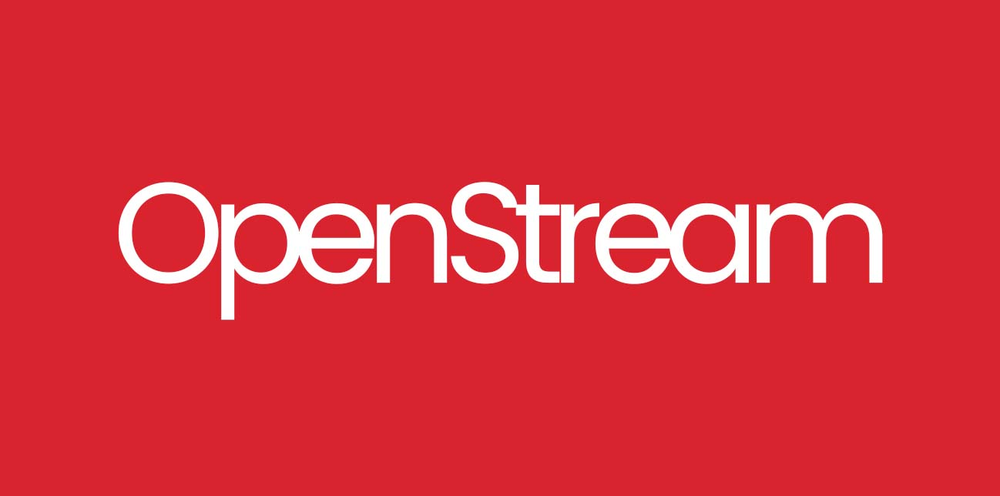

# OpenStream

<p align="center">
  
</p>

**The Open Source, Community-Curated IPTV Aggregator.**

OpenStream is a collaborative project to build a reliable, clean, and tested list of public streaming channels.
We rely on the community to add links, and we use **GitHub Actions** to automatically test them daily, ensuring the final playlist is always "Green" (100% working).

## How to Use

### For Viewers(Watch TV)
Copy the link below and paste it into your favorite IPTV Player (TiviMate, VLC, IPTV Smarters, OttPlayer, etc.):


```

https://sajadtroy.github.io/openstream/index.m3u

```

### For Contributors (Add Channels)
**All types of content are accepted**, provided they are publicly available. We welcome contributions from all categories (News, Sports, Education, Entertainment, etc.).

To add a channel:
1.  **Go to** the `streams/` folder and edit `<any>.m3u`.
2.  **Add your channel** following the M3U format (see below).
3.  **Submit a Pull Request (PR)**.
4.  Once merged, our bot will test the link. If it works, it will appear in the main list within 24 hours.

#### Submission Format
Please include the `group-title` (Category) and a clean logo URL if possible.

```text
#EXTINF:-1 group-title="Category" tvg-logo="https://example.com/logo.png", Channel Name
https://link-to-stream.m3u8


```

## Legal Disclaimer & Risk Warning

**Please read this carefully before using or contributing to this repository.**

### 1. Content Ownership

* **The Project Owner (SajadTroy) does NOT own, host, or broadcast any content.**
* This repository is purely a **search index** and aggregator of links found by users on the public internet.
* All stream URLs, logos, and channel names are the property of their respective copyright holders.

### 2. Contributor Liability (The "Risk" Clause)

* **The risk of copyright infringement lies solely with the contributor.**
* By submitting a Pull Request (PR) to this repository, the Contributor warrants that they have the legal right to share the link.
* The Project Owner does not verify the licensing status of user-submitted links. If a contributor submits a copyrighted or illegal link, **the contributor assumes full legal responsibility** for that submission.

### 3. DMCA & Takedowns

* We comply with the Digital Millennium Copyright Act (DMCA).
* If you are a content owner and believe a link infringes on your copyright, please open a GitHub Issue, and **we will remove the link immediately**.
* We claim "Safe Harbor" status under 17 U.S.C. § 512 as a service provider that stores information at the direction of users.

## How it Works

* **Daily Scan:** Every day at 08:00 UTC, a GitHub Action runs a Python script.
* **Validation:** The script checks every link in the database.
* **Filtering:** Dead links (404/Timeout) are removed from the final output.
* **Result:** The `index.m3u` file is updated with only working streams.

## License

This project is licensed under the [MIT License](https://github.com/SajadTroy/openstream?tab=MIT-1-ov-file).